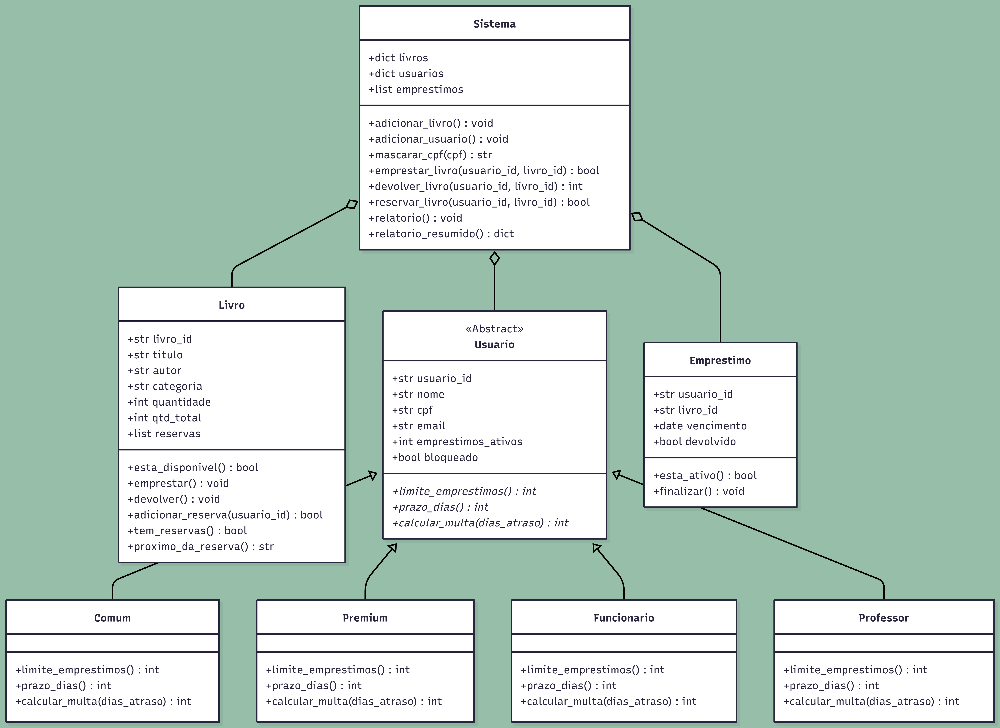

# Sistema de Gestão de Biblioteca (Refatoração & POO)

Projeto de refatoração e evolução de um sistema legado de biblioteca acadêmica, aplicando **Programação Orientada a Objetos (POO)**, **Princípios SOLID (SRP e OCP)**, **Privacidade de Dados (LGPD)**, **Rastreabilidade via Logging**, **Guard Clauses** e **Testes de Caracterização Automatizados**.

---

## 📐 Diagrama de Classes

<p align="center">
  
</p>

---

## 📌 Funcionalidades Principais

- **Polimorfismo e Categorias de Usuários (OCP - Extensão 1):**
  - Perfis suportados: `Comum`, `Premium`, `Funcionario` e `Professor`.
  - O perfil `Professor` permite até 15 empréstimos simultâneos, prazo de 60 dias e isenção total de multas (R$ 0).
- **Ciclo de Empréstimos e Devoluções Seguras (Guard Clauses):**
  - Validações defensivas antecipadas (*Guard Clauses*) no nível 0 de indentação.
  - Correção do bug legado ao validar usuários e livros inexistentes antes do acesso a atributos.
- **Fila de Reserva FIFO (Extensão 3):**
  - Fila de espera sequencial (*First In, First Out*) para livros com estoque esgotado (`quantidade == 0`).
  - Notificação automática do próximo usuário beneficiado no momento em que o exemplar é devolvido.
- **Relatórios Gerenciais Segregados (SRP - Extensão 2):**
  - **Relatório Analítico:** Detalhamento completo do acervo e status individual dos usuários.
  - **Relatório Resumido:** Agregação estatística em tempo real (total de títulos, acervo total, empréstimos ativos e atrasos).
- **Segurança e Observabilidade (LGPD & Logging):**
  - Anonimização de dados sensíveis (LGPD) através de mascaramento de CPF (`********XXXX`).
  - Substituição de `print()` por `logging.Logger` centralizado com formatação padronizada.

---

## 🏗️ Estrutura Modular de Módulos

```
c:\projetos\legacy-code-refactoring\
├── config/
│   ├── __init__.py
│   └── logger.py            # Configuração centralizada do Logger nativo (Níveis INFO/WARNING)
├── models/
│   ├── __init__.py
│   ├── livro.py             # Modelo Livro + Fila de Reserva (FIFO)
│   ├── usuario.py           # Polimorfismo de Usuários (Comum, Premium, Funcionario, Professor) + Factory Method
│   └── emprestimo.py        # Modelo Emprestimo e controle de vencimentos
├── services/
│   ├── __init__.py
│   └── biblioteca_service.py # Serviço de orquestração e regras de negócio com Guard Clauses
├── reports/
│   ├── __init__.py
│   └── relatorio_service.py  # Serviço exclusivo para formatação de Relatórios (SRP)
├── biblioteca_legado.py     # Ponto de entrada (Main) executando a demonstração dos 8 cenários operacionais
├── test_sistema.py          # Suíte com 10 testes de caracterização e regressão automatizados
├── RELATORIO.md             # Relatório de entrega oficial (Parte 3 - AV1)
├── README.md                # Documentação técnica e operacional do projeto
└── docs/
    └── diagrama_classes.png # Diagrama visual de classes do domínio
```

---

## ⚙️ Como Executar

### 1. Execução dos Cenários de Demonstração (8 Cenários Operacionais)
Para executar a simulação completa contendo todos os fluxos de empréstimo, atrasos, reservas e relatórios:

```bash
python biblioteca_legado.py
```

### 2. Execução dos Testes Automatizados (10 Testes)
Para rodar a suíte de testes de regressão e caracterização:

```bash
python test_sistema.py
```